# ☸️ Kubernetes Local Practice on Windows — Beginner Setup Guide

A beginner-friendly, step-by-step guide to set up a local Kubernetes practice environment on a Windows laptop **without any cloud Kubernetes platform**.

**Setup path:** Windows → Docker Desktop → kind → Kubernetes cluster → kubectl → VS Code

It also explains the concepts behind the commands so you understand *why* you run them.

---

## 📑 Table of Contents

1. [What You Will Build](#1-what-you-will-build)
2. [Important Definitions](#2-important-definitions)
3. [Why kind?](#3-why-use-kind-instead-of-docker-desktop-kubernetes)
4. [Prerequisites](#4-prerequisites)
5. [Install & Setup (Steps 1–6)](#5-step-1--check-docker)
6. [Understanding the Cluster](#11-understanding-the-kubectl-context)
7. [YAML & First Practice](#16-why-yaml-is-important)
8. [Cheat Sheet](#23-useful-commands-cheat-sheet)
9. [Troubleshooting](#27-troubleshooting)
10. [Roadmap & Golden Rules](#29-learning-roadmap)

---

## 1. What You Will Build

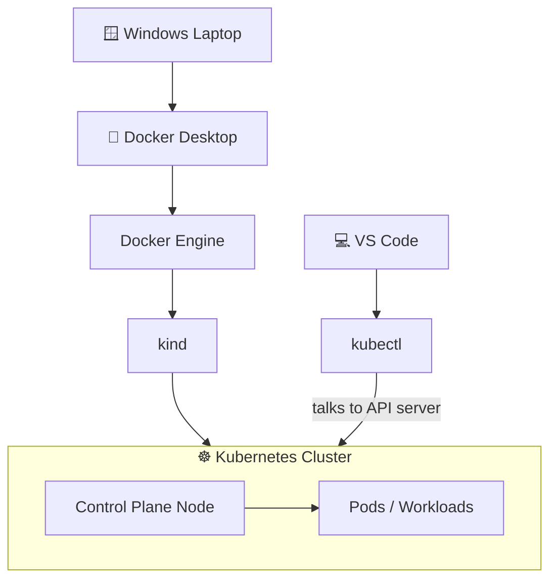

> 📖 **What this diagram explains**
> This is the full stack of your local setup, read top to bottom. Your Windows laptop runs Docker Desktop, which provides Docker Engine. **kind** uses Docker Engine to create a Kubernetes cluster inside a Docker container, so no cloud or virtual machine is needed. You control the cluster with **kubectl**, and you write commands and YAML in **VS Code**. Each layer depends on the one above it, so if Docker is not running, nothing below it works.

You will be able to practice:

- Pods
- Deployments
- ReplicaSets
- Services
- ConfigMaps
- Secrets
- Namespaces
- Scaling
- Self-healing
- Rolling updates
- Networking
- Ingress
- Kubernetes YAML
- Docker images inside Kubernetes

---

## 2. Important Definitions

### Docker

Docker is a platform for building, packaging, and running applications in containers.

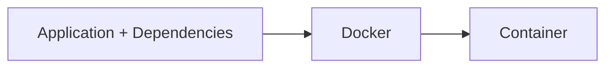

> 📖 **What this diagram explains**
> Docker takes your application and everything it needs to run (libraries, runtime, settings) and packs it into one unit called a container. The container runs the same way on any machine, which removes the "it works on my computer" problem.

### Kubernetes

Kubernetes is a container orchestration platform. It manages containers/workloads across one or more nodes and provides:

- deployment
- scaling
- service discovery
- self-healing
- rolling updates
- scheduling

### Kubernetes Cluster

A cluster is the complete Kubernetes environment managed as one system.

### Node

A node is a machine/environment where Kubernetes workloads run. With kind, Kubernetes nodes are implemented as Docker containers.

### Pod

A Pod is Kubernetes' smallest deployable unit. It normally holds one application container, but can hold multiple tightly coupled containers that share networking and storage.

### Container

A container is the isolated runtime environment containing an application and its dependencies.

### kind

`kind` means **Kubernetes IN Docker**. It creates local Kubernetes clusters using Docker containers as nodes — ideal for local learning and testing.

### kubectl

`kubectl` is the Kubernetes command-line tool. It talks to the Kubernetes API server and lets you:

- create resources
- inspect resources
- view logs
- scale applications
- delete resources
- troubleshoot workloads

### YAML

Kubernetes YAML files describe the **desired state** of resources.

```yaml
apiVersion: apps/v1
kind: Deployment
metadata:
  name: nginx
spec:
  replicas: 3
```

This says: the desired resource is a Deployment named `nginx` with three replicas.

### Cluster vs Node vs Pod vs Container

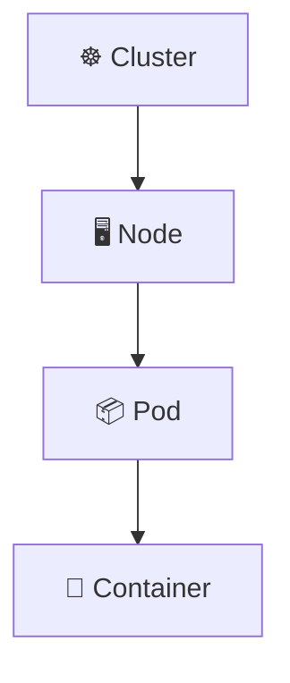

> 📖 **What this diagram explains**
> This is the container-like hierarchy of Kubernetes, from biggest to smallest. A **cluster** contains **nodes**, a node runs **Pods**, and a Pod holds one or more **containers**. Kubernetes never schedules a bare container. It always schedules a Pod, and the Pod carries the containers inside it.

---

## 3. Why Use kind Instead of Docker Desktop Kubernetes?

Docker Desktop can provide a local Kubernetes cluster, but this guide uses **kind**.

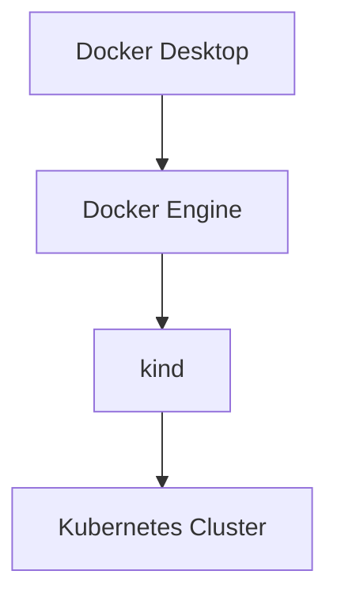

> 📖 **What this diagram explains**
> Docker Desktop is only the base that supplies Docker Engine. The cluster itself is created by **kind**, not by Docker Desktop's built-in Kubernetes. Because kind creates and deletes clusters with one command, you can experiment freely and start fresh whenever something breaks.

This keeps cluster creation explicit and makes it easy to create and delete practice clusters.

> ⚠️ **Important**
> - Do **NOT** enable Docker Desktop's built-in Kubernetes just to use kind.
> - Docker Desktop only needs to be running so Docker Engine is available.
> - Your Kubernetes cluster is created by **kind**.

---

## 4. Prerequisites

| # | Requirement | Required? |
|---|-------------|-----------|
| 1 | Windows 10/11 | ✅ |
| 2 | Docker Desktop | ✅ |
| 3 | kind | ✅ |
| 4 | kubectl | ✅ |
| 5 | VS Code | Recommended |

### Official download / documentation links

| Tool | Link |
|------|------|
| Docker Desktop | https://docs.docker.com/desktop/setup/install/windows-install/ |
| kind | https://kind.sigs.k8s.io/ |
| kind Quick Start | https://kind.sigs.k8s.io/docs/user/quick-start/ |
| kubectl (Windows) | https://kubernetes.io/docs/tasks/tools/install-kubectl-windows/ |
| Kubernetes tools | https://kubernetes.io/docs/tasks/tools/ |
| VS Code | https://code.visualstudio.com/ |
| VS Code Kubernetes extension | https://marketplace.visualstudio.com/items?itemName=ms-kubernetes-tools.vscode-kubernetes-tools |

### Setup flow at a glance

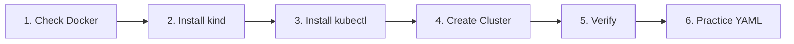

> 📖 **What this diagram explains**
> This is the order of the whole setup. Confirm Docker works first, install the two tools (kind and kubectl), create the cluster, check that it is healthy, and only then start practicing with YAML. Following this order avoids most beginner errors, because each step depends on the previous one.

---

## 5. Step 1 — Check Docker

Open PowerShell and run:

```powershell
docker version
```

Purpose:

- checks whether Docker CLI is installed
- checks whether Docker Engine is reachable

Docker Desktop must be running. You can also run:

```powershell
docker info
```

If Docker is working, these commands return Docker information instead of a connection error.

---

## 6. Step 2 — Install kind

### Method A — Winget (easiest)

```powershell
winget install Kubernetes.kind
```

After installation, close PowerShell and open a new window. Check:

```powershell
kind version
```

Expected output contains a version such as:

```text
kind v0.33.0
```

### Method B — Direct download

```powershell
curl.exe -Lo kind-windows-amd64.exe https://kind.sigs.k8s.io/dl/v0.33.0/kind-windows-amd64
```

Move and rename it into a directory in PATH:

```powershell
New-Item -ItemType Directory -Path "C:\Tools" -Force
Move-Item ".\kind-windows-amd64.exe" "C:\Tools\kind.exe"
```

Add the directory to your user PATH:

```powershell
$oldPath = [Environment]::GetEnvironmentVariable("Path", "User")
[Environment]::SetEnvironmentVariable("Path", "$oldPath;C:\Tools", "User")
```

Close PowerShell, open a new one, then:

```powershell
kind version
where.exe kind
```

Expected:

```text
C:\Tools\kind.exe
```

> ⚠️ **Common mistake:** The official example may contain `c:\some-dir-in-your-PATH\kind.exe`. That is a placeholder — do NOT use it literally unless you created that directory.

---

## 7. Step 3 — Install kubectl

```powershell
winget install -e --id Kubernetes.kubectl
```

Close PowerShell, open a new one, then check:

```powershell
kubectl version --client
where.exe kubectl
```

### kubectl version compatibility

Kubernetes recommends using a kubectl version within **one minor version** of the cluster.

```text
Cluster v1.37
kubectl v1.36 / v1.37 / v1.38   ✅
```

For strict matching, check the Kubernetes version supported by your kind release/node image.

---

## 8. Step 4 — Do You Need a Special Folder to Create the Cluster?

**No.** You can run the command from any directory:

```powershell
kind create cluster --name k8s-learning
```

For example: `C:\Users\YourName>`, `E:\Downloads>`, `C:\Projects>`.

The cluster is **NOT** created inside your current folder. Your folder is for project files/YAML. The kind node is a Docker container managed by Docker.

---

## 9. Step 5 — Create the Kubernetes Cluster

Make sure Docker Desktop is running, then:

```powershell
kind create cluster --name k8s-learning
```

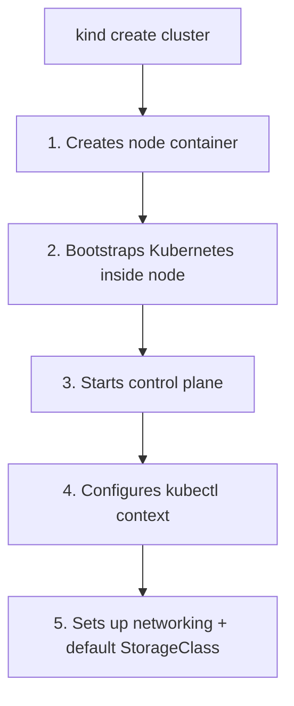

> 📖 **What this diagram explains**
> One command triggers five automatic actions. kind first creates a Docker container that acts as your node. It installs and starts Kubernetes inside that container, then brings up the control plane (the "brain"). Next it writes a kubectl context so kubectl knows how to reach the new cluster. Finally it prepares networking and a default storage class, so your apps can communicate and store data.

To wait until the cluster is ready:

```powershell
kind create cluster --name k8s-learning --wait 5m
```

---

## 10. Step 6 — Verify the Cluster

```powershell
kind get clusters
```

Expected:

```text
k8s-learning
```

Check Docker containers:

```powershell
docker ps
```

You should see a container like `k8s-learning-control-plane`.

Check Kubernetes nodes:

```powershell
kubectl get nodes
```

Expected:

```text
NAME                         STATUS   ROLES           AGE
k8s-learning-control-plane   Ready    control-plane   ...
```

---

## 11. Understanding the kubectl Context

```powershell
kubectl config get-contexts
```

You should see a context like `kind-k8s-learning`.

```powershell
kubectl config current-context
kubectl config use-context kind-k8s-learning
```

A context tells kubectl **which cluster to send commands to**. This matters when you have more than one cluster.

---

## 12. What Does cluster-info Do?

```powershell
kubectl cluster-info --context kind-k8s-learning
```

You may see:

```text
Kubernetes control plane is running at https://127.0.0.1:<port>
CoreDNS is running at https://127.0.0.1:<port>/...
```

Meaning:

- `kubectl` successfully contacted your cluster.
- The control plane/API server is reachable.
- CoreDNS is running.
- `127.0.0.1` means localhost (your own computer).
- The number after `:` is a local port — don't memorize it, it can vary.

---

## 13. What Is the Control Plane?

The control plane is the management/decision-making part of Kubernetes.

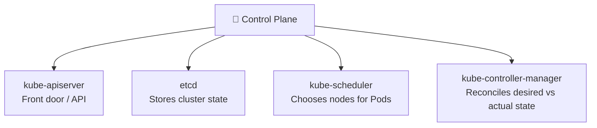

> 📖 **What this diagram explains**
> The control plane is made of four parts, each with one job. The **API server** is the front door that receives every request. **etcd** is the database that remembers the cluster's state. The **scheduler** decides which node should run a new Pod. The **controller manager** keeps watching and corrects the cluster whenever reality differs from what you asked for.

Simplified request flow:

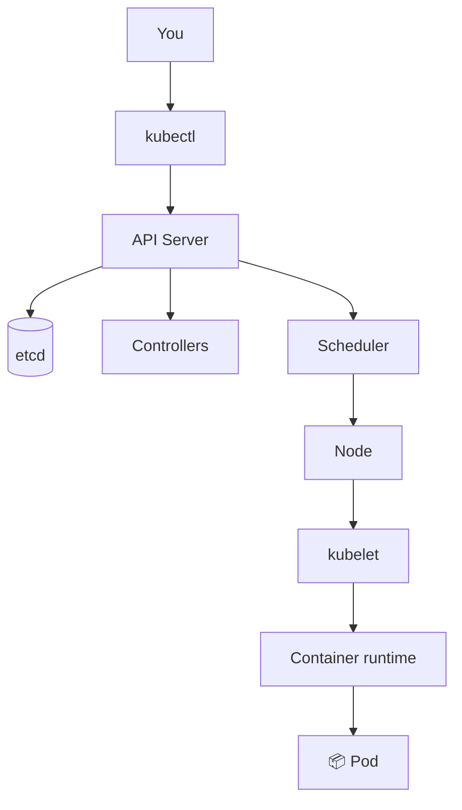

> 📖 **What this diagram explains**
> This shows what happens when you run a command such as `kubectl apply`. kubectl sends the request to the API server, which saves it in etcd. Controllers notice the new desired state, and the scheduler picks a node. On that node, the **kubelet** (the node's agent) asks the container runtime to start the containers, and the Pod comes to life.

---

## 14. What Is CoreDNS?

CoreDNS provides DNS-based service discovery inside Kubernetes.

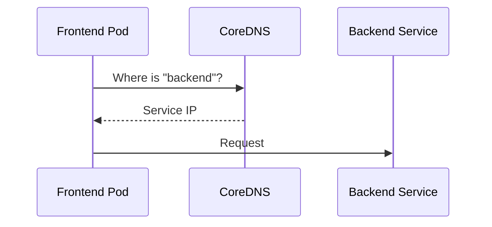

> 📖 **What this diagram explains**
> Pods are created and deleted all the time, so their IP addresses keep changing. Instead of remembering IPs, the frontend simply asks CoreDNS for the name "backend". CoreDNS replies with the Service's stable IP, and the frontend sends its request there. It works like a phone book for your cluster.

Instead of hard-coding a changing Pod IP, applications use Kubernetes Service DNS names. This matters when learning Services.

---

## 15. Where Is the Cluster Data Stored?

With kind, the Kubernetes node is a Docker container. Run `docker ps` to see it.

Your project YAML files are separate:

```text
kubernetes-practice/
 ├── pod.yaml
 ├── deployment.yaml
 └── service.yaml
```

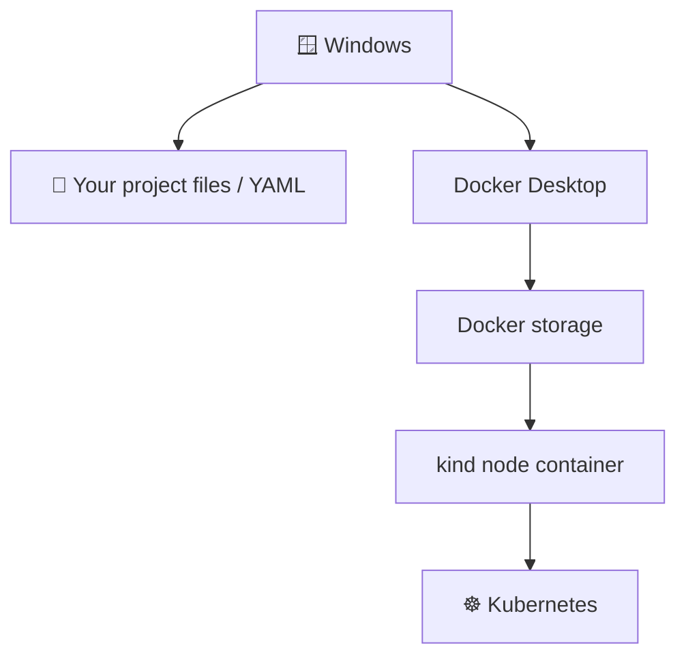

> 📖 **What this diagram explains**
> Your laptop holds two separate things. One is your **project files** (YAML), which live in normal Windows folders. The other is the **cluster**, which lives inside Docker's storage in the kind node container. Deleting the cluster does not delete your YAML files, and that is why you should keep them in Git.

> Do not manually edit Docker's internal storage to manage Kubernetes resources. Keep your YAML files in Git instead.

---

## 16. Why YAML Is Important

YAML describes the desired state of a Kubernetes resource.

```yaml
apiVersion: v1
kind: Pod

metadata:
  name: nginx-pod

spec:
  containers:
    - name: nginx
      image: nginx
      ports:
        - containerPort: 80
```

Then:

```powershell
kubectl apply -f pod.yaml
```

> *"Kubernetes, make the cluster match what is described in this file."*

| Field | Meaning |
|-------|---------|
| `apiVersion` | Kubernetes API version for the resource |
| `kind` | Resource type (`Pod`, `Deployment`, `Service`, ...) |
| `metadata` | Identifies the object (e.g. `name: nginx-pod`) |
| `spec` | Desired configuration |

---

## 17. Important: `kind` vs `kind`

There are **two** meanings of the word `kind`:

| Usage | Example | Meaning |
|-------|---------|---------|
| `kind:` in YAML | `kind: Deployment` | The resource type |
| `kind` command | `kind create cluster` | The local Kubernetes tool |

They are unrelated uses of the same word.

---

## 18. First Kubernetes Practice — Pod

Create a folder:

```powershell
mkdir "$HOME\kubernetes-practice"
cd "$HOME\kubernetes-practice"
```

Create `pod.yaml`:

```yaml
apiVersion: v1
kind: Pod

metadata:
  name: nginx-pod

spec:
  containers:
    - name: nginx-container
      image: nginx
      ports:
        - containerPort: 80
```

Apply, inspect, and delete:

```powershell
kubectl apply -f pod.yaml
kubectl get pods
kubectl describe pod nginx-pod
kubectl logs nginx-pod
kubectl delete pod nginx-pod
```

---

## 19. Why a Pod Is Not Enough

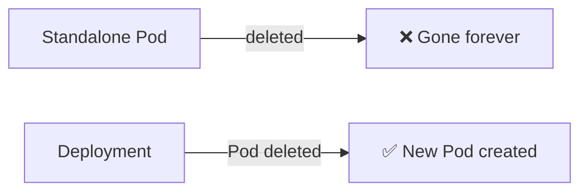

> 📖 **What this diagram explains**
> If you delete a standalone Pod, it is simply gone, because nothing is responsible for bringing it back. A Deployment is different: it keeps a target number of Pods alive, so if one disappears, it creates a replacement. In real projects you almost always use a Deployment instead of a bare Pod.

A standalone Pod has no controller saying *"I always want one copy of this application."* For that, use a **Deployment**.

---

## 20. First Deployment

Create `deployment.yaml`:

```yaml
apiVersion: apps/v1
kind: Deployment

metadata:
  name: nginx-deployment

spec:
  replicas: 3

  selector:
    matchLabels:
      app: nginx

  template:
    metadata:
      labels:
        app: nginx

    spec:
      containers:
        - name: nginx
          image: nginx
          ports:
            - containerPort: 80
```

```powershell
kubectl apply -f deployment.yaml
kubectl get deployments
kubectl get pods
```

You should have approximately **3 nginx Pods**.

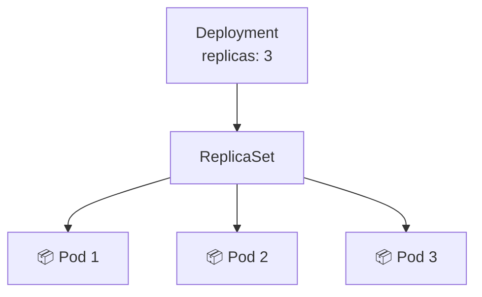

> 📖 **What this diagram explains**
> You create a **Deployment** and ask for 3 replicas. The Deployment automatically creates a **ReplicaSet**, whose only job is to keep exactly 3 Pods running. So there are three layers of control: Deployment → ReplicaSet → Pods. You manage the Deployment, and Kubernetes handles the rest.

---

## 21. Scaling

```powershell
kubectl scale deployment nginx-deployment --replicas=5
kubectl get pods
kubectl scale deployment nginx-deployment --replicas=2
```

This demonstrates the desired-state model:

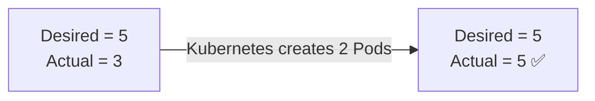

> 📖 **What this diagram explains**
> This is the core idea of Kubernetes: you tell it what you **want** (desired state), and it works to make reality (actual state) match. When you ask for 5 Pods but only 3 exist, Kubernetes notices the gap and creates the 2 missing Pods. Scaling down works the same way in reverse.

---

## 22. Self-Healing

Delete one Deployment-managed Pod:

```powershell
kubectl delete pod <pod-name>
kubectl get pods
```

A replacement Pod is created because the Deployment wants the configured number of replicas.

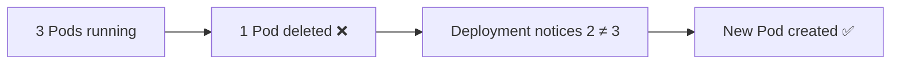

> 📖 **What this diagram explains**
> Self-healing is the same desired-state idea applied to failures. When a Pod is deleted or crashes, the Deployment sees that only 2 of the 3 wanted Pods exist. It immediately starts a new Pod to restore the count, without any action from you.

---

## 23. Useful Commands Cheat Sheet

### Cluster

```powershell
kind get clusters
kind create cluster --name k8s-learning
kind delete cluster --name k8s-learning
```

### kubectl context

```powershell
kubectl config get-contexts
kubectl config current-context
kubectl config use-context kind-k8s-learning
```

### Cluster information

```powershell
kubectl cluster-info
kubectl cluster-info --context kind-k8s-learning
kubectl get nodes
```

### Pods

```powershell
kubectl get pods
kubectl get pods -A
kubectl describe pod <pod-name>
kubectl logs <pod-name>
kubectl delete pod <pod-name>
```

### Deployments

```powershell
kubectl get deployments
kubectl describe deployment <deployment-name>
kubectl scale deployment <deployment-name> --replicas=5
kubectl delete deployment <deployment-name>
```

### YAML

```powershell
kubectl apply -f file.yaml
kubectl delete -f file.yaml
```

### Docker

```powershell
docker ps
docker images
docker info
docker version
```

---

## 24. Loading Your Own Docker Image into kind

Suppose you build:

```powershell
docker build -t my-app:1.0 .
```

The image exists in Docker, but kind nodes don't automatically have it. Load it:

```powershell
kind load docker-image my-app:1.0 --name k8s-learning
```

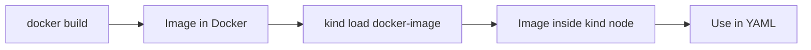

> 📖 **What this diagram explains**
> The kind node is its own separate container, so it cannot see images stored on your laptop's Docker. You build the image first, then copy it into the node with `kind load docker-image`. After that, your YAML can use the image name and Kubernetes will find it.

Then reference it in YAML:

```yaml
containers:
  - name: my-app
    image: my-app:1.0
```

> For locally loaded images, avoid relying on the implicit `:latest` behavior; use an explicit tag and an appropriate `imagePullPolicy` when needed.

---

## 25. VS Code Setup

- Install VS Code: https://code.visualstudio.com/
- Install the Kubernetes extension: https://marketplace.visualstudio.com/items?itemName=ms-kubernetes-tools.vscode-kubernetes-tools

The extension helps you:

- browse clusters
- inspect Pods, Deployments, Services
- edit Kubernetes manifests
- view logs
- run commands in Pods

You should still learn `kubectl` commands — understanding the CLI is important.

---

## 26. Recommended Project Structure

```text
kubernetes-local-windows-guide/
│
├── README.md
│
├── docs/
│   ├── 01-concepts.md
│   ├── 02-installation.md
│   ├── 03-kind-cluster.md
│   ├── 04-kubectl.md
│   ├── 05-yaml.md
│   └── 06-troubleshooting.md
│
├── manifests/
│   ├── pod/
│   │   └── nginx-pod.yaml
│   └── deployment/
│       └── nginx-deployment.yaml
│
├── commands/
│   └── kubectl-cheatsheet.md
│
└── .gitignore
```

---

## 27. Troubleshooting

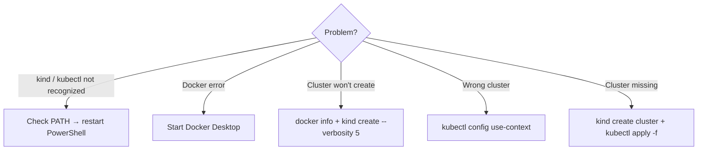

> 📖 **What this diagram explains**
> This is a decision tree for common problems. Find the symptom you see and follow its arrow to the fix. Most problems come from one of three causes: a tool missing from PATH, Docker not running, or kubectl pointing at the wrong cluster.

### `kind` is not recognized

```powershell
where.exe kind
Get-Item "C:\Tools\kind.exe"
```

If nothing is returned, make sure `kind.exe` is in a PATH directory. Add `C:\Tools` to your user PATH if needed and restart PowerShell.

### `kubectl` is not recognized

```powershell
winget install -e --id Kubernetes.kubectl
where.exe kubectl
kubectl version --client
```

Restart PowerShell after installing.

### Docker is not running

```powershell
docker version
```

Start Docker Desktop and try again.

### kind cannot create the cluster

```powershell
docker info
kind version
kubectl version --client
kind create cluster --name k8s-learning
kind create cluster --name k8s-learning --verbosity 5
```

### The wrong Kubernetes cluster is selected

```powershell
kubectl config get-contexts
kubectl config use-context kind-k8s-learning
kubectl config current-context
```

### Cluster disappeared

```powershell
kind get clusters
kind create cluster --name k8s-learning
kubectl apply -f deployment.yaml
kubectl apply -f service.yaml
```

Your YAML files are separate from the cluster, so you can recreate resources anytime. This is one reason to keep manifests in Git.

---

## 28. Stop vs Delete

### Delete the kind cluster

```powershell
kind delete cluster --name k8s-learning
```

This removes the kind cluster/node containers.

### Create it again

```powershell
kind create cluster --name k8s-learning
```

Your Git/YAML files are unaffected.

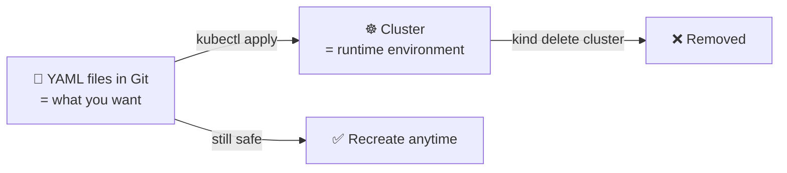

> 📖 **What this diagram explains**
> YAML files describe *what you want*, and the cluster is *where it runs*. They are independent. Deleting the cluster removes only the running environment, while your YAML files stay safe. You can create a new cluster and apply the same files to get everything back.

### 🧹 Clean up (optional)

```powershell
kubectl delete -f deployment.yaml
kind delete cluster --name k8s-learning
kind get clusters
```

---

## 29. Learning Roadmap

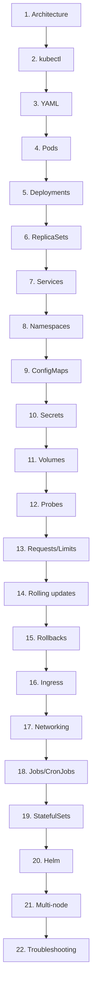

> 📖 **What this diagram explains**
> This is the suggested study order, from easy to advanced. It starts with the basics (architecture, kubectl, YAML), then workloads (Pods, Deployments), then networking and configuration (Services, ConfigMaps, Secrets), then production topics (probes, limits, updates, Ingress), and finally advanced tools (StatefulSets, Helm, multi-node clusters). Each topic builds on the one before it.

---

## 30. Golden Rules for Beginners

1. **Docker and Kubernetes are not the same thing.**
2. Docker runs/packages containers; Kubernetes orchestrates workloads.
3. A cluster is the whole Kubernetes environment.
4. A node is a machine/environment in the cluster.
5. A Pod is the smallest deployable Kubernetes unit.
6. `kubectl` is the command-line client.
7. `kind` creates local Kubernetes clusters using Docker containers as nodes.
8. `kind:` in YAML is different from the `kind` CLI tool.
9. YAML describes desired state.
10. Keep your YAML/manifests in Git.
11. Do not manually modify Docker's internal storage.
12. Learn `kubectl`, even if you use the VS Code Kubernetes extension.
13. For local learning, you do not need a cloud Kubernetes service.
14. Start with one-node clusters; learn multi-node clusters later.

---

## 31. Quick Start After Everything Is Installed

If Docker Desktop is running and kind/kubectl are installed:

```powershell
kind create cluster --name k8s-learning
kubectl config use-context kind-k8s-learning
kubectl cluster-info --context kind-k8s-learning
kubectl get nodes
kubectl get pods -A
```

Create a practice folder and apply a manifest:

```powershell
mkdir "$HOME\kubernetes-practice"
cd "$HOME\kubernetes-practice"
kubectl apply -f deployment.yaml
kubectl get deployments
kubectl get pods
```

---

## 32. Official References

- kind: https://kind.sigs.k8s.io/
- kind Quick Start: https://kind.sigs.k8s.io/docs/user/quick-start/
- Kubernetes documentation: https://kubernetes.io/docs/
- kubectl Windows installation: https://kubernetes.io/docs/tasks/tools/install-kubectl-windows/
- Kubernetes tools: https://kubernetes.io/docs/tasks/tools/
- Docker Desktop Windows installation: https://docs.docker.com/desktop/setup/install/windows-install/
- Docker Desktop documentation: https://docs.docker.com/desktop/
- VS Code: https://code.visualstudio.com/
- VS Code Kubernetes extension: https://marketplace.visualstudio.com/items?itemName=ms-kubernetes-tools.vscode-kubernetes-tools

---

## 🧠 Final Mental Model

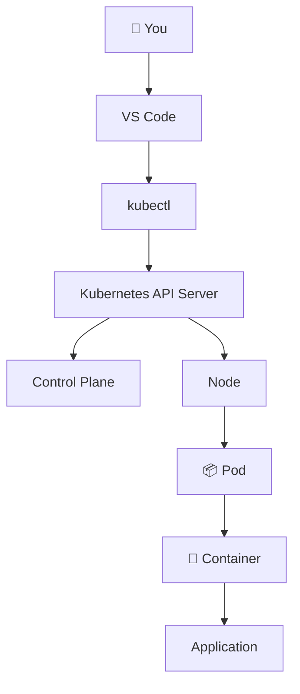

> 📖 **What this diagram explains**
> This is how a command travels through Kubernetes. You write in VS Code and run kubectl, which sends the request to the API server. The control plane decides what to do, and a node carries it out by running a Pod. Inside the Pod, a container runs your application.

And for this local setup:

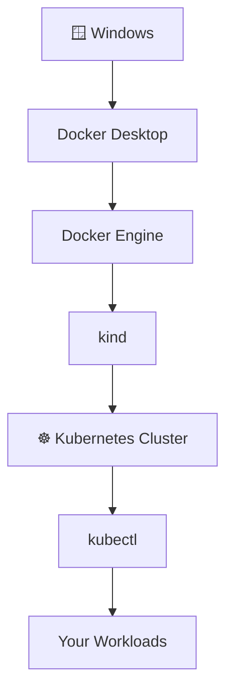

> 📖 **What this diagram explains**
> This is the same idea as the very first diagram, simplified into one line: Windows runs Docker, Docker runs kind, kind creates Kubernetes, and kubectl lets you deploy your workloads onto it.

If you understand these diagrams, you understand the foundation of the environment you are building. 🚀
