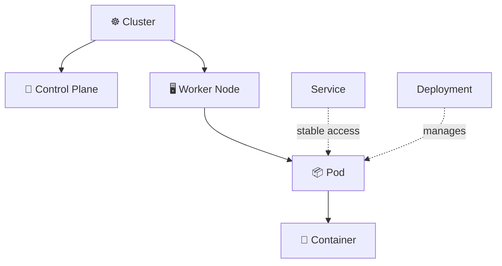
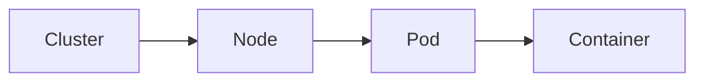
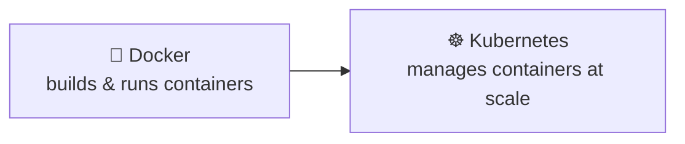
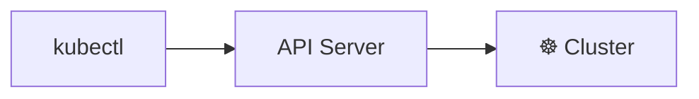
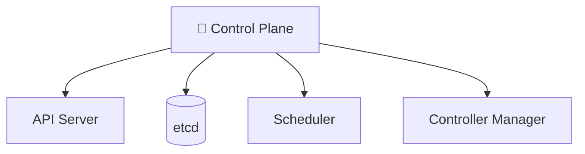
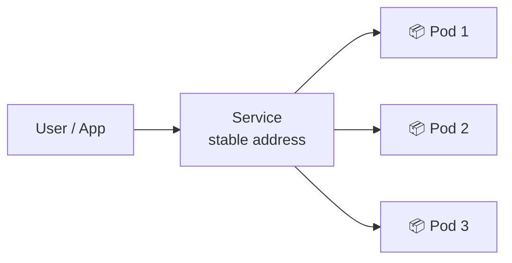
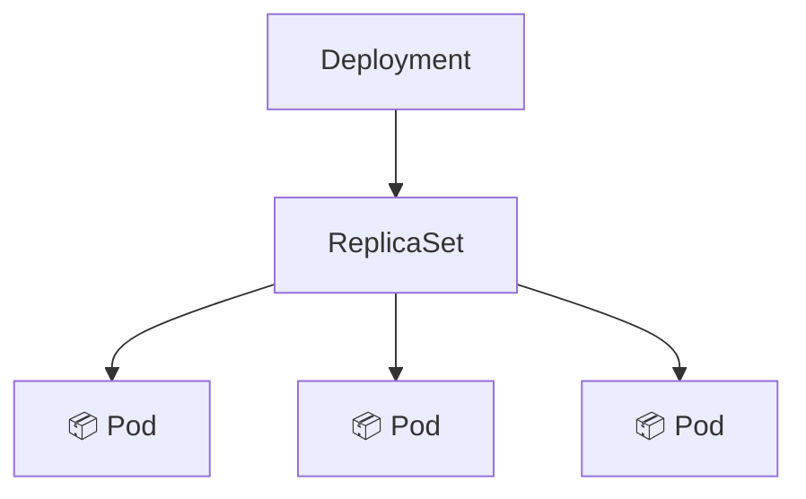

# 📘 Kubernetes Concepts — Beginner Notes

Quick definitions of the key terms used in this guide.

## 🗺️ Big Picture



> 📖 **What this diagram explains**
> This map shows how the main Kubernetes pieces fit together. The **cluster** has a control plane (the brain) and worker nodes (where apps run). Nodes run Pods, and Pods hold containers. The dotted lines show helpers: a **Deployment** manages the Pods (keeps the right number alive), and a **Service** gives them a stable address so others can reach them.

## 📑 Quick Reference

| Term | Simple Meaning |
|------|----------------|
| [Cluster](#cluster) | The whole Kubernetes environment |
| [Node](#node) | A machine that runs workloads |
| [Pod](#pod) | Smallest deployable unit |
| [Container](#container) | Isolated runtime for an app |
| [Docker](#docker) | Builds and runs containers |
| [Kubernetes](#kubernetes) | Orchestrates containers |
| [kind](#kind) | Local Kubernetes using Docker |
| [kubectl](#kubectl) | Kubernetes command-line tool |
| [Control Plane](#control-plane) | The "brain" of Kubernetes |
| [Service](#service) | Stable network endpoint for Pods |
| [Deployment](#deployment) | Manages replicated Pods |
| [YAML](#yaml) | File format describing desired state |
| [CoreDNS](#coredns) | DNS inside the cluster |
| [Context](#context) | Which cluster kubectl talks to |

---

## Cluster

The complete Kubernetes environment managed as one system.

## Node

A machine/environment on which Kubernetes workloads run.

## Pod

The smallest deployable Kubernetes unit. A Pod contains one or more containers.

## Container

An isolated runtime environment for an application.



> 📖 **What this diagram explains**
> Each item contains the next one, from largest to smallest: a cluster contains nodes, a node runs Pods, and a Pod holds containers. Remember it as "boxes inside boxes".

## Docker

Builds, packages, and runs containers.

## Kubernetes

Orchestrates and manages containerized workloads.



> 📖 **What this diagram explains**
> Docker and Kubernetes do different jobs. Docker creates and runs individual containers. Kubernetes sits on top and manages many containers across machines, handling scaling, restarts, and updates. You need containers first, then something to manage them.

## kind

**K**ubernetes **IN** **D**ocker. Creates local Kubernetes clusters using Docker containers as nodes.

## kubectl

The Kubernetes CLI used to communicate with the Kubernetes API server.



> 📖 **What this diagram explains**
> kubectl never touches the cluster directly. It sends your command to the **API server**, which is the single entry point, and the API server then acts on the cluster.

## Control Plane

The management side of Kubernetes. Important components include the API server, etcd, scheduler, and controller manager.



> 📖 **What this diagram explains**
> The control plane has four parts. The **API server** receives requests, **etcd** stores the cluster's data, the **scheduler** picks which node runs each Pod, and the **controller manager** keeps the actual state matching the desired state.

## Service

A stable network endpoint for accessing a group of Pods.



> 📖 **What this diagram explains**
> Pod IP addresses change whenever Pods are replaced. A Service gives users and other apps one fixed address and spreads traffic across the healthy Pods behind it, so callers never need to know individual Pod IPs.

## Deployment

A Kubernetes controller used to manage replicated application Pods and support rolling updates.



> 📖 **What this diagram explains**
> A Deployment creates a ReplicaSet, and the ReplicaSet keeps the required number of identical Pods running. When you update the app, the Deployment creates a new ReplicaSet and gradually replaces the old Pods, which is called a rolling update.

## YAML

A human-readable format used to describe Kubernetes desired state.

```yaml
apiVersion: apps/v1
kind: Deployment
metadata:
  name: nginx
spec:
  replicas: 3
```

## CoreDNS

Provides DNS-based service discovery inside the cluster.

## Context

A kubectl configuration entry that identifies which Kubernetes cluster/user/namespace kubectl should use.

```powershell
kubectl config get-contexts
kubectl config use-context kind-k8s-learning
```
