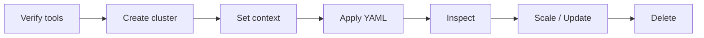
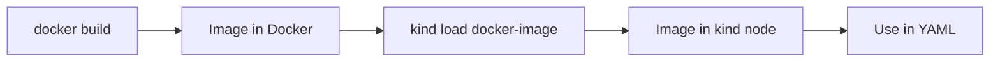

# ⚡ Kubernetes Command Cheat Sheet

## 🔄 Typical Workflow



> 📖 **What this diagram explains**
> This is the normal life cycle of a practice session. Check that your tools work, create a cluster, make sure kubectl points at it, apply your YAML, inspect the result with `get`, `describe`, and `logs`, then scale or update, and finally clean up. Most commands below belong to one of these stages.

## Verify tools

```powershell
docker version
kind version
kubectl version --client
```

## kind

```powershell
kind get clusters
kind create cluster --name k8s-learning
kind delete cluster --name k8s-learning
```

## Context

```powershell
kubectl config get-contexts
kubectl config current-context
kubectl config use-context kind-k8s-learning
```

## Cluster

```powershell
kubectl cluster-info
kubectl cluster-info --context kind-k8s-learning
kubectl get nodes
kubectl get pods -A
```

## Workloads

```powershell
kubectl get pods
kubectl describe pod <pod-name>
kubectl logs <pod-name>

kubectl get deployments
kubectl describe deployment <deployment-name>
kubectl scale deployment <deployment-name> --replicas=5
```

## YAML

```powershell
kubectl apply -f file.yaml
kubectl delete -f file.yaml
```

## Docker + kind

```powershell
docker build -t my-app:1.0 .
kind load docker-image my-app:1.0 --name k8s-learning
```



> 📖 **What this diagram explains**
> Images built on your laptop are not automatically visible inside the kind node. You build the image, load it into the node with `kind load docker-image`, and then reference its name and tag in your YAML.

## 🔍 Quick Lookup Table

| I want to... | Command |
|--------------|---------|
| See all clusters | `kind get clusters` |
| See which cluster kubectl uses | `kubectl config current-context` |
| List nodes | `kubectl get nodes` |
| List Pods in all namespaces | `kubectl get pods -A` |
| Debug a Pod | `kubectl describe pod <pod-name>` |
| Read Pod logs | `kubectl logs <pod-name>` |
| Scale an app | `kubectl scale deployment <name> --replicas=5` |
| Apply a YAML file | `kubectl apply -f file.yaml` |
| Remove resources from YAML | `kubectl delete -f file.yaml` |
