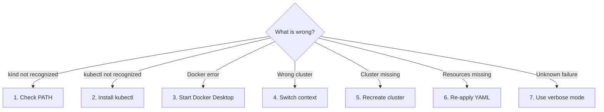
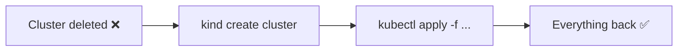

# 🛠️ Troubleshooting — Windows + Docker + kind + kubectl

## 🧭 Quick Diagnosis



> 📖 **What this diagram explains**
> Start at the question "What is wrong?" and follow the arrow that matches your symptom to the numbered fix below. Most problems fall into three groups: a tool is not found (fixes 1–2), Docker is not running (fix 3), or kubectl is pointing at the wrong or a missing cluster (fixes 4–6). Fix 7 is the last resort when the cause is unclear.

| Symptom | Fix |
|---------|-----|
| `kind` is not recognized | [Fix 1](#1-kind-is-not-recognized) |
| `kubectl` is not recognized | [Fix 2](#2-kubectl-is-not-recognized) |
| Cannot connect to Docker | [Fix 3](#3-docker-is-unavailable) |
| Commands hit the wrong cluster | [Fix 4](#4-wrong-kubectl-context) |
| Cluster is gone | [Fix 5](#5-cluster-does-not-exist) |
| Apps are gone after recreating | [Fix 6](#6-recreate-resources-after-recreating-the-cluster) |
| Cluster creation fails | [Fix 7](#7-get-more-detail-from-kind) |

---

## 1. kind is not recognized

```powershell
where.exe kind
```

If using `C:\Tools`:

```powershell
Get-Item "C:\Tools\kind.exe"
```

Make sure `C:\Tools` is in your user PATH, then restart PowerShell.

## 2. kubectl is not recognized

```powershell
winget install -e --id Kubernetes.kubectl
```

Restart PowerShell and test:

```powershell
kubectl version --client
```

## 3. Docker is unavailable

```powershell
docker version
docker info
```

Start Docker Desktop and retry.

## 4. Wrong kubectl context

```powershell
kubectl config get-contexts
kubectl config use-context kind-k8s-learning
kubectl config current-context
```

## 5. Cluster does not exist

```powershell
kind get clusters
kind create cluster --name k8s-learning
```

## 6. Recreate resources after recreating the cluster

Your YAML files are outside the cluster:

```powershell
kubectl apply -f deployment.yaml
kubectl apply -f service.yaml
```



> 📖 **What this diagram explains**
> A new cluster starts empty, but your YAML files still describe everything you had. Create the cluster again and apply the files, and your apps return. This is why keeping YAML in Git is so useful.

## 7. Get more detail from kind

```powershell
kind create cluster --name k8s-learning --verbosity 5
```

---

## ✅ Health Check (run when unsure)

```powershell
docker info
kind get clusters
kubectl config current-context
kubectl get nodes
kubectl get pods -A
```

If all five work, your environment is healthy.
